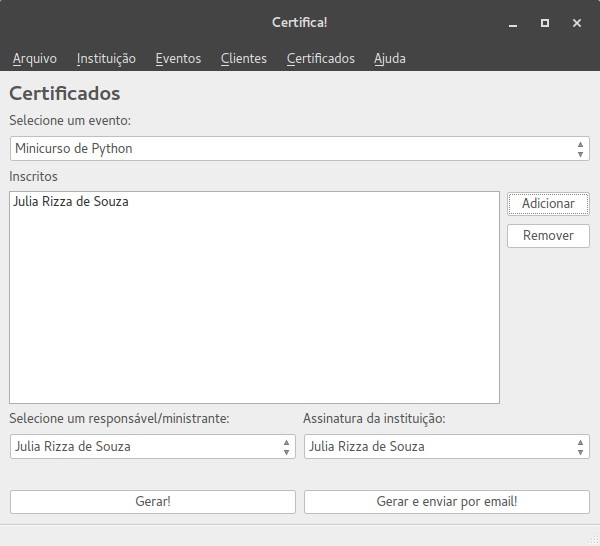

# Certifica!
> Gerador de certificados para cursos livres & eventos feito em Python

> *Free courses & events certificate generator made with Python*

Um gerador de certificados para cursos livres e eventos feito em Python para gerar certificados em PDF e, inclusive, enviá-los por e-mail. É só cadastrar seu evento e logo em seguida seus participantes e, *voilà*, certificados emitidos!



## Recursos
* Cadastro de dados da instituição
* Cadastro de eventos e clientes
* Armazena assinaturas
* Geração de certificados em PDF
* Envio de certificados por e-mail
* Template de certificado facilmente editável, em HTML

## Instalação
Faça o clone

```
git clone https://github.com/juliarizza/certificate_generator.git
```

Instale as dependências

*PyQt4 é uma dependência externa, verifique a instalação para seu sistema operacional*

```
cd certificate_generator
pip install -r requirements.txt
apt-get install python-qt4
```

Execute

```
python app.py
```

## Contribua!
Copyright (c) 2016 Júlia Rizza & licensed under GNU GPLv3
